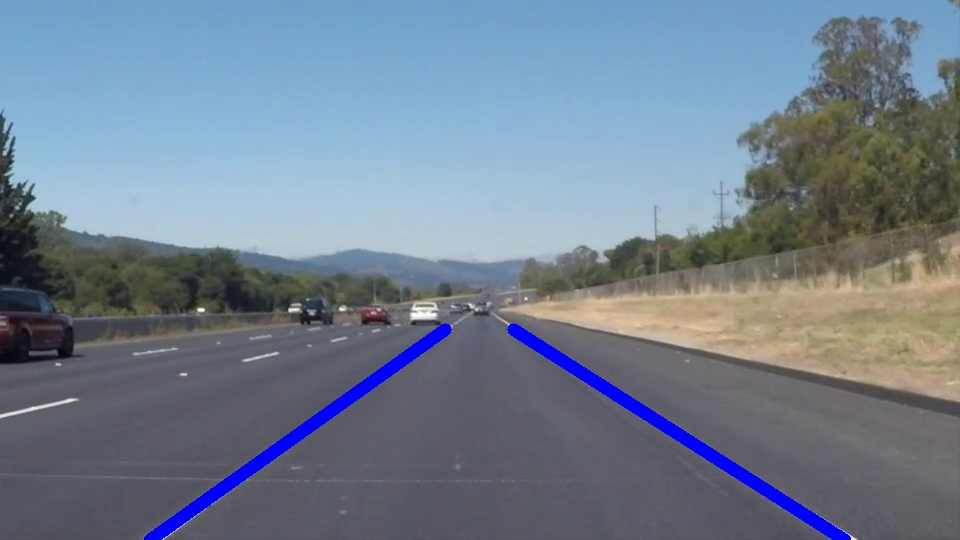

# Lane line detection

This program detects straight lines on the road.

## Dependencies
* python
* opencv-python
* numpy 

## Steps
* region of interest
* canny edge detector
* hough lines detection
* compute good lines

## Run
Run ```python main.py``` in CMD
